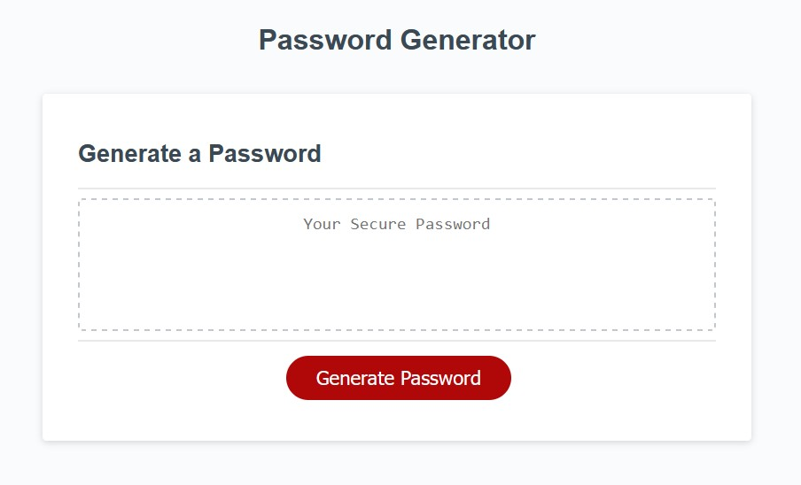

# Password Generator

## Description

A tool for employees to generate random passwords within parameters that they opt-in to. The site will prompt employees for password length (between 8 and 128 characters), whether or not they'd like to include uppercase characters, lowercase characters, numeric characters, and special characters. Once employees have made their selection of criteria, their password will be displayed in a text box ready for them to copy. If no criteria is selected then the site will generate a random password consisting of uppercase, lowercase, and numeric characters.

## Usage

Employees can click the red "Generate Password" button to begin the criteria selection process. The site will then begin displaying prompts, one-by-one and one for each criteria, to which employees only have to select "OK" to make their selection. Once all prompts have been completed, a randomized password will be displayed for employees to copy.

## Page Link and Appearance

[Create your password here!](https://navidliwa.github.io/password-generator/)

## License

Licensed under the MIT License